# Air Quality Monitor User Manual

Welcome to Air Quality Monitor, a real time web application that displays information from sensors connected to a Raspberry Pi, allowing real time monitoring of indoor or outdoor air quality data. This user manual is designed to help you understand the system architecture, how it works and how to install it.

## Introduction
Air Quality Monitor is a web application that is built with Node.js and Express for server side handling while the front end is consisted of HTML, EJS and Bootstrap for styling. It utilises SQLite3 for database handling.

## 1 Installation Guide

### 1.1 Download and Installation

Please install NodeJS first HERE:
<br>
https://nodejs.org/en/
<br>
After installation, open up Command Line and run “npm install DEPENDENCY”
<br>
Replace DEPENDENCY with each dependency listed below:
<br>
Dependencies Server Side:
<br>
● ExpressJS
<br>
● npm
<br>
● SQLite
<br>
● Express Session
<br>
● BCrypt
<br>
● Dotenv
<br>
● Nodemailer
<br>
● EJS
<br>
● NodeJS
<br>
● Bootstrap
<br>
● JQuery
<br>
● Chartjs
<br>
● Chartjs Annotation
<br>
After that is complete, please navigate to the code/website directory where you need to create an enviroment file (.env).
<br>
Please use this template for the .env file and fill in the "CHANGE" text with your own details as necessary.
```
EMAIL_USERNAME=CHANGE
EMAIL_PASSWORD=CHANGE
ADMIN_REGISTRATION_CODE=CHANGE
```
<br>
Dependencies Data Collection side (Raspberry Pi)
<br>
● Clone the github repository
<br>
● https://gitlab.computing.dcu.ie/linr2/2023-ca326-ThirdYearProject
<br>
● Run install.sh
<br>
This should install most if not all dependencies.
<br>
Clone the repository to the device you want to act as server.
<br>
Then,

1. Change Directory to the Website directory
2. Type and run this command, “node server.js”
3. Server should be up and running.
On the Raspberry Pi end,
1. Make sure you’re using the latest stable Raspberry Pi OS.
2. Once the repo has been cloned, change directory to the root directory where
start.py is located.
3. Run this command “python3 start.py”.

## 2. End User Guide:
### 2.1 Regular User Guide

#### 1. Prerequisites:
Use a modern supported browser e.g Firefox, Chrome, Edge, Opera.
<br>

#### Home page:
The main landing page is here, you should be able to see a navigation bar at the stop allowing you to select sensor nodes, register or sign up.
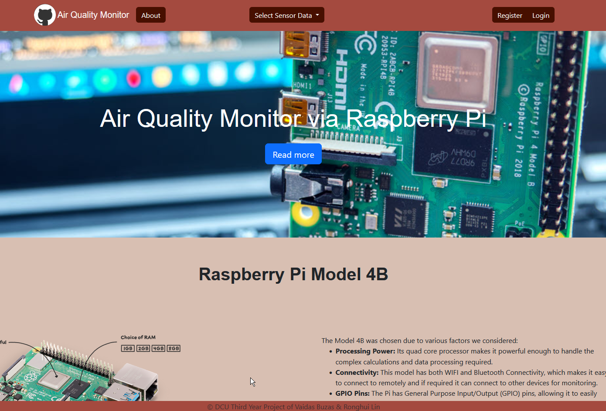
<br>

#### About:
By clicking on Read More or on the About button in the navigation bar, it will redirect you to some background information about this project.
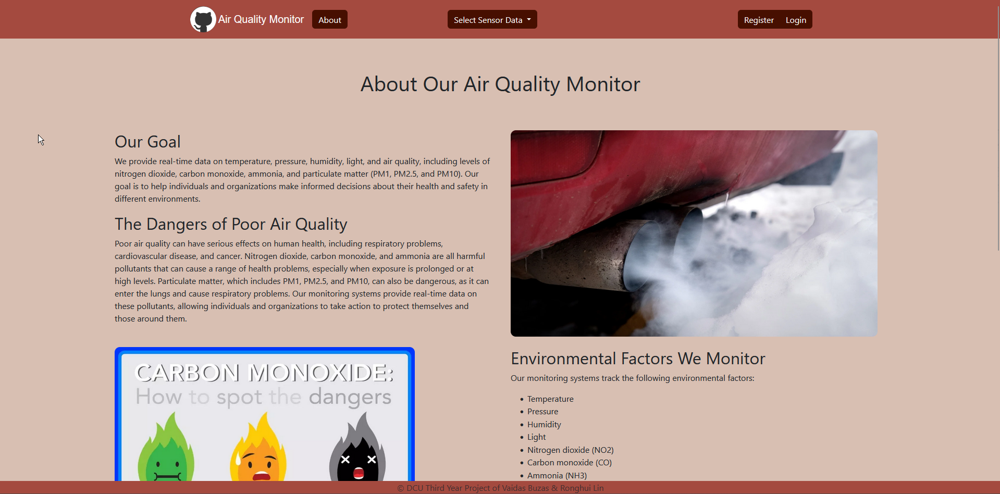

<br>

#### Sensor Data:

Press Select Sensor Data, a drop down menu should appear displaying all available options to choose.

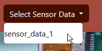

<br>

Once selected, you should be redirected to the data page where all the available data from the node is charted and updated in real time.

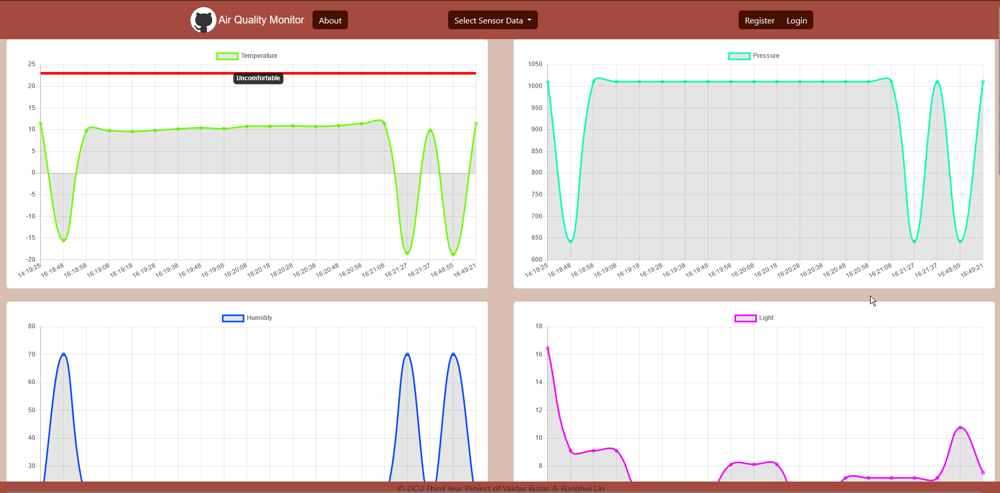
<br>

#### Registration:

These are the only available features for an unregistered guest user, if you wish to become registered, please press the register button at the navigation bar.
<br> Here you should be redirected to our registration page where you can sign up.

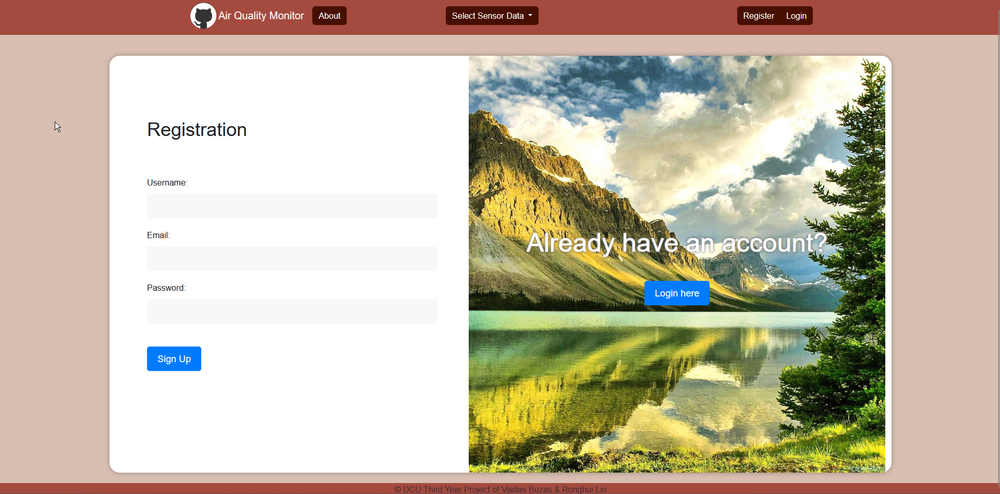

<br>

#### Login:

After signing up, you should navigate to the Login page where you can input the details you just signed up with.
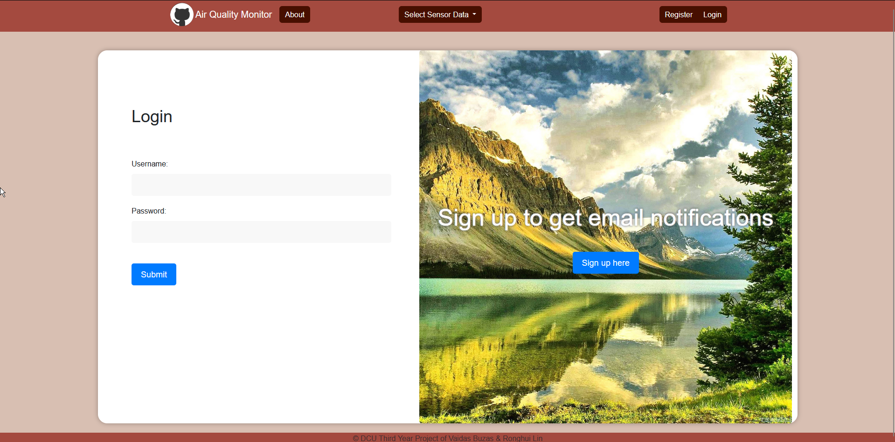
<br> 

#### Navigation Bar Update:

Upon logging in, you will now see that the navigation bar at the top has changed and various features have been added.
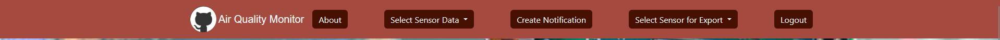

#### Notification Creation:

<br> To use these features, please return to the where the sensor data is charted, then press on the Create Notification button, this UI should appear after.

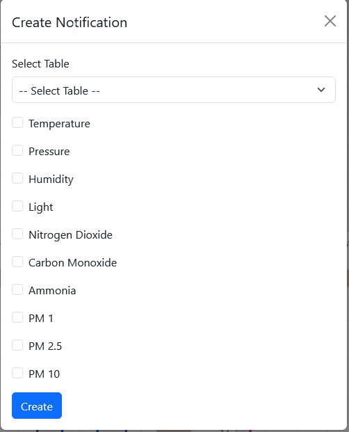
<br>
This notification pop up allows you to select which sensor node to create a notification for and which values to monitor by ticking the boxes and inputting a threshold number.
<br>

#### Export:

Next we have the export button, upon pressing the export button you will be greeted with options to choose which node you want to export data from. Once selected it will output the data to .CSV format.

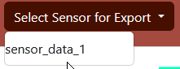
<br>

This sums up the guide for regular users and guest users.

### 2.1 Admin User Guide

Admins may register by navigating to the /admin-register page by appending "/admin-register" to the end of the base website URL.
Once at that page, you will be greeted by this page.
## NOTE: THE REGISTRATION CODE MUST BE SET IN THE .ENV FILE AND USED WHENEVER YOU NEED TO REGISTER AN ADMIN.

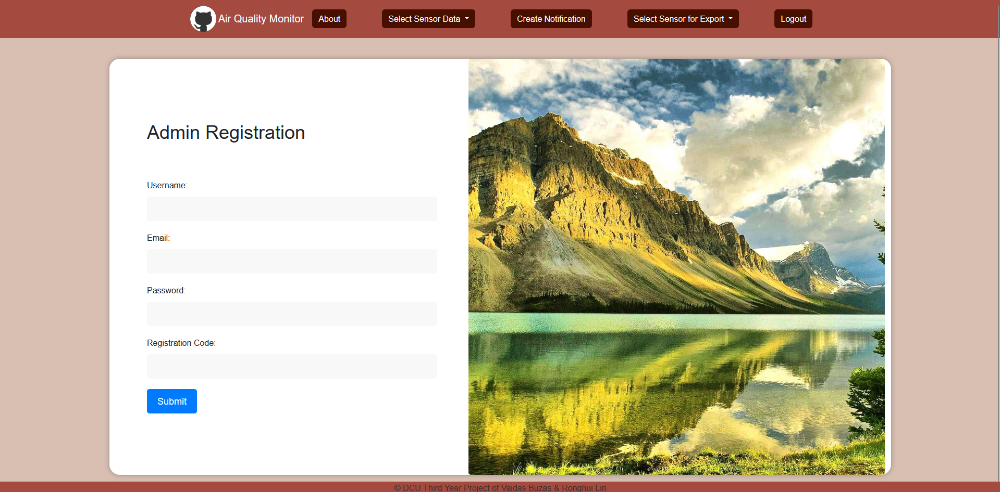

<br>
After registration, the admin may use the regular login page to login.
<br>
Once logged in the navigational bar should update to include "Admin Dashboard". Press on admin dashboard.
<br>
Then page should then appear.
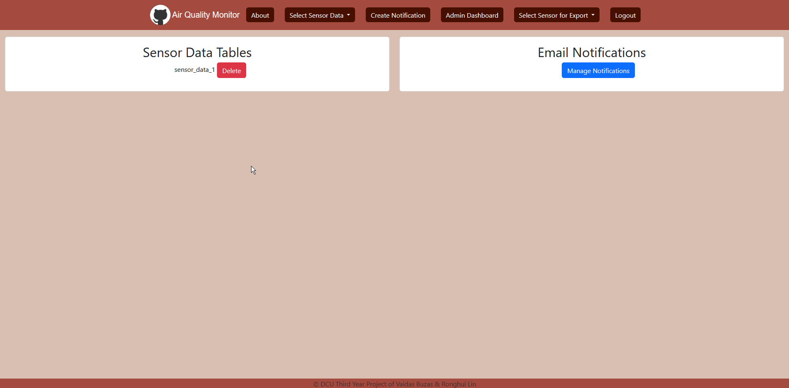
<br>

You will see two options, on th left it displays all the sensor data tables in the system and by clicking delete will remove them from being able to be viewed.
On the right Manage Notifications will appear, allowing you to see a pop up with the ability to select multiple notifications to delete via checkbox and displaying the ID and which email it belongs to.
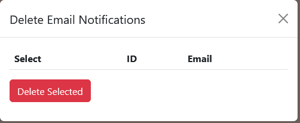